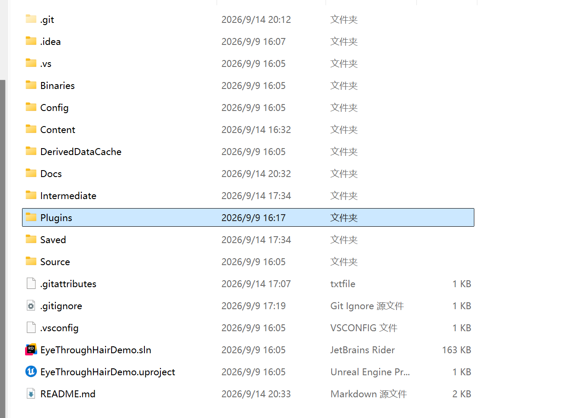
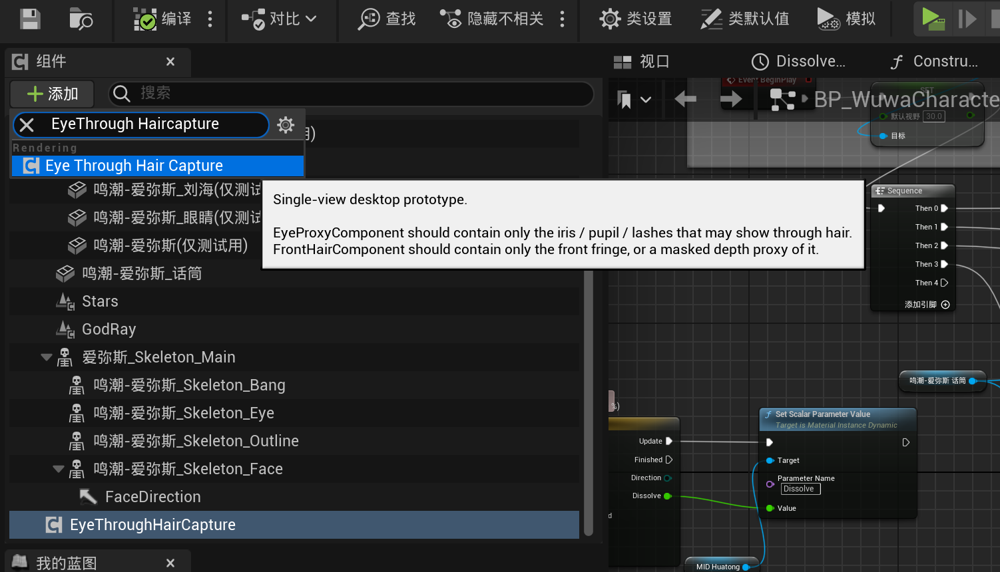
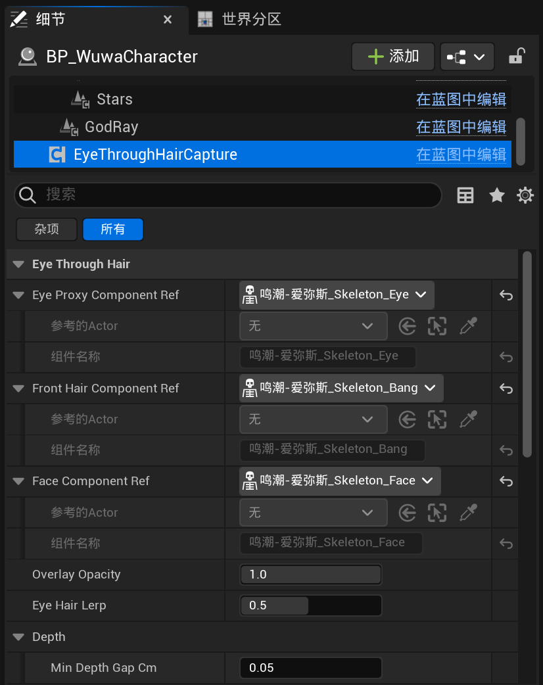

# EyeThroughHairDemo

Unreal Engine 5.4 演示工程，包含 `HairEyeThrough` 渲染插件，
用于演示角色眼睛透过前刘海显示的效果。

## 效果展示

## 环境要求

- Unreal Engine 5.4
- Visual Studio 2022
- Windows SDK
- C++ 开发环境

## 环境与启动

1. 克隆仓库到本地。

2. 右键 `EyeThroughHairDemo.uproject`，选择 **Generate Visual Studio project files**。

3. 打开生成的解决方案。

4. 使用 `Development Editor / Win64` 编译 `EyeThroughHairDemo`。

5. 打开 `EyeThroughHairDemo.uproject`。

6. 打开地图：

   `/Game/Map/TestCleanMap`

## 使用方法

### 1. 安装插件

将：

`Plugins/HairEyeThrough`

复制到目标 UE C++ 工程的：

`Plugins/`

目录中。

### 2. 添加组件

打开角色蓝图，添加：

`EyeThroughHairCaptureComponent`

### 3. 设置组件引用

选中 `EyeThroughHairCaptureComponent`，配置：

- `EyeProxyComponentRef`：眼睛代理组件
- `FrontHairComponentRef`：前刘海组件
- `FaceComponentRef`：脸部组件

## 注意事项

演示角色来源于鸣潮，由于版权原因，本仓库不提供演示效果图中使用的角色模型及贴图资源，材质的贴图需自行配置。

仓库仅包含插件源码、演示工程和渲染所需材质。